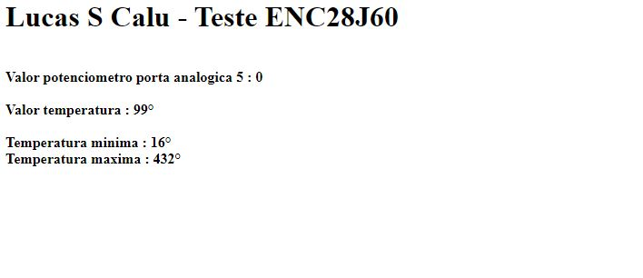
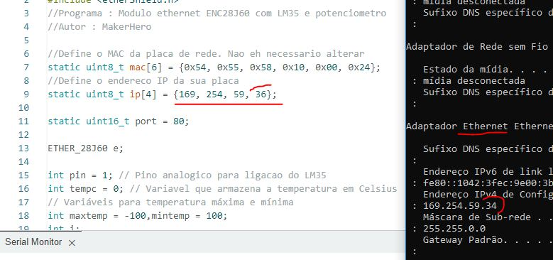
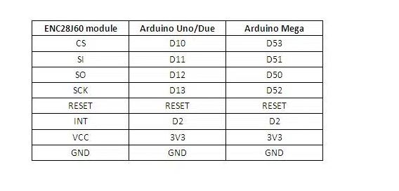

# Webserver simples com Arduino COM Potênciometro e shield_Ethernet

## Referências extraidas das páginas makerhero

Através do uso do shield ethernet e um simples potênciometro é possível criar um web server para realizar medidas 

Faça as conexões adequadas e atribua um ip disponível em seu ponto de rede (ex roteador,pc,modem,etc) dentro do seu código para que o mesmo funcione 

SEGUE ABAIXO ESQUEMA DE LIGAÇÃO (DIAGRAMA ELETRÔNICO)

